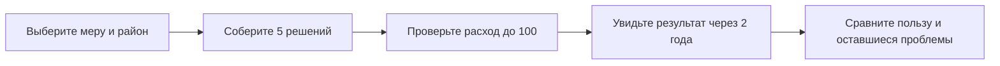
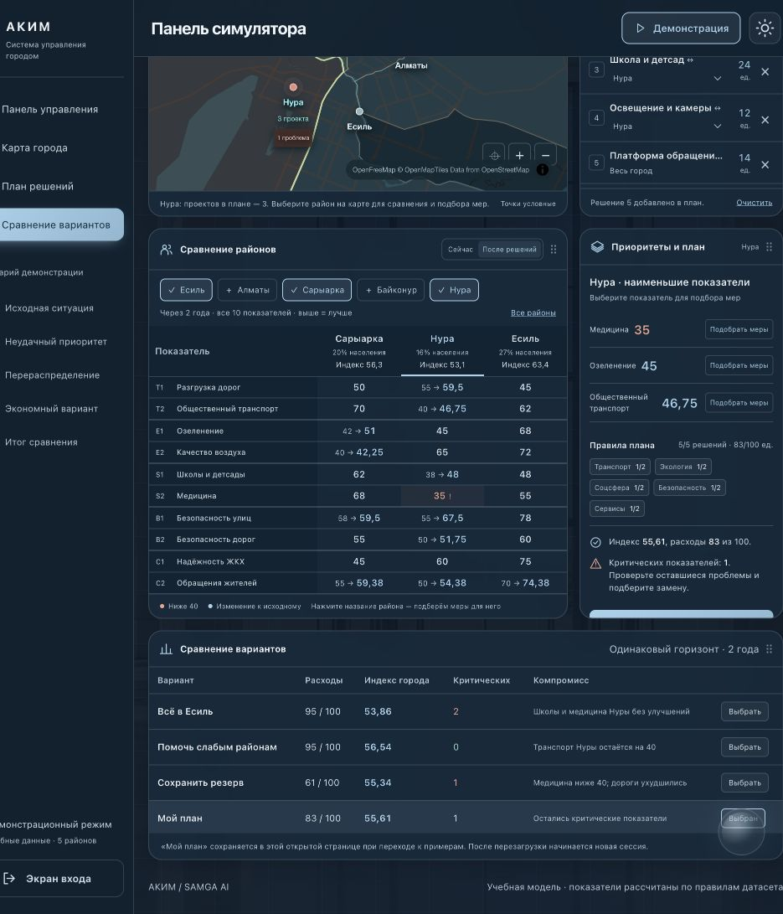

# АКИМ / SAMGA AI — «Аким на 5 часов»

**Выберите пять городских проектов, уложитесь в бюджет 100 и увидьте, кому станет лучше через два года.** Сравните свой план с альтернативами: общий балл, показатели районов и нерешённые проблемы.

Учебные данные из задания HackAlem AI. Расчёт воспроизводимый; это не официальная статистика и не прогноз реального бюджета Астаны.

**Для эксперта:** [маршрут проверки](docs/user-guide/JURY-CHECK.md) · [соответствие критериям и доказательства](docs/jury/EVIDENCE.md) · [итог приёмки командой](docs/user-guide/ACCEPTANCE.md) · [источники и повторно использованные компоненты](SOURCES.md).

## Что показать за три минуты

- **Одинаковые деньги — разные последствия.** Два плана стоят95: перенос тех же мер между районами меняет индекс53,86→56,54 и число критических показателей2→0.
- **Решение можно проверить.** Полный поиск в модели перебирает694395 допустимых назначений. При исходных ограничениях максимум —57.236735 за98 единиц; результат относится к учебному датасету и заданной цели.
- **Видна цена приоритета.** Устранить критические значения в модели можно за66; обязательная школа в Нуре повышает минимум до80. Поиск показывает условия и оставшиеся компромиссы.
- **Результат можно передать и повторить.** HTML-записка для руководителя, JSON с пятью решениями и возврат на карту с сохранением плана. Отдельно представлены реальные iPhone-демо для акима и жителя.

## Запустить и начать

Нужны **Node.js 24+**, современный браузер с WebGL и интернет для карты. Установка npm-пакетов и аккаунт для расчёта не требуются. Из корня репозитория:

```sh
node backend/server.mjs
```

Команда одинакова на macOS, Windows и Linux. Откройте **[АКИМ](http://127.0.0.1:4197/)** → **«Открыть демонстрацию»**. Почта и пароль не нужны. Сервер останавливается клавишами `Ctrl+C`. Если порт занят, остановите прежний экземпляр этой платформы; не завершайте чужие процессы.

`127.0.0.1` — адрес вашего компьютера. Чтобы показать продукт на другом ноутбуке, запустите там эту же версию репозитория; это не общая интернет-ссылка. Один сервер отдаёт веб-панель, расчётный API, отчёты и мобильную галерею.

## Два понятных пути

| Хочу | Что нажать |
|---|---|
| Сначала понять идею | **«Посмотреть пример»** — готовый показ: проблема → неудачный выбор → перераспределение → сравнение |
| Принять решения самому | **«Составить свой план»** — каталог мер с ценами, районами и последствиями |
| Вспомнить порядок действий | **«Как пользоваться»** — короткая инструкция прямо в панели |
| Подобрать альтернативу и сохранить итог | **«Подбор и отчёт»** — поиск и скачивание HTML/JSON |
| Посмотреть мобильные роли | **«Мобильная версия»** — настоящие iPhone-скриншоты и маршруты |



1. Нажмите **«Составить свой план»** или **«Новый план»**. Каталог откроется сразу.
2. Выберите **район мероприятия**, затем **«Добавить»** на карточке. Для городской меры район не нужен.
3. Добавьте следующие меры через **«+ Мера»**. Недоступные сочетания объясняются под названием: повтор, превышение бюджета или конфликт.
4. После **пятой допустимой меры** результат рассчитывается автоматически. До этого вместо итогового балла стоит `—`.
5. В **«Сравнение районов»** выберите нужные районы и переключите **«Сейчас / После решений»**. В **«Сравнение вариантов»** сопоставьте свой план с примерами.

Чтобы заменить меру, нажмите её название в списке решений. Выбор готового примера сохраняет ваш план **в текущей открытой странице** — вернитесь через строку **«Мой план»**. После перезагрузки начнётся новая сессия.

## Повторите проверенный пример

Одна мера из каждого из **пяти направлений**:

| Мера | Куда | Цена |
|---|---|---:|
| M1 · Выделенные полосы для автобусов | Нура | 18 |
| M4 · Парк / сквер | Сарыарка | 15 |
| M7 · Школа + детсад | Нура | 24 |
| M10 · Освещение и камеры | Нура | 12 |
| M12 · Единая цифровая платформа обращений | Весь город | 14 |

**Ожидаемый результат:** потрачено **83**, осталось **17**, индекс **52,56 → 55,61**, критических показателей **2 → 1**. Точный итог модели: `55.60722`.

В Нуре школы растут с **38 до 48**, общественный транспорт — с **40 до 46,75**. Медицина остаётся на **35**: рост общего балла не означает решения всех проблем. Парк находится в Сарыарке, потому что парк и школа несовместимы в одном районе.



**Быстрое сравнение:** выберите «Всё в Есиль», затем «Помочь слабым районам». При одинаковых расходах **95** индекс меняется **53,86 → 56,54**, критические значения **2 → 0**. Это примеры, а не доказательство глобального оптимума; второй вариант охватывает четыре направления.

## Как читать показатели

- **Бюджет** — расход и остаток из условных 100 единиц, не тенге.
- **Индекс качества жизни / Score** — общий балл модели. Он учитывает население, показатели районов, слабейший район и штраф за критические значения. Выше — лучше по правилам этого датасета.
- **Критическое значение** — показатель строго ниже **40**. Знак `!` помогает найти его.
- **Сейчас / После решений** — исходное состояние и результат на горизонте **8 кварталов**. Задержки проектов уже учтены.
- **Карта** — обзор районов; точки условные и не обозначают реальные участки строительства.

## Что реализовано по ТЗ

| Требование | Как проверить |
|---|---|
| Пять самостоятельных решений, районные и городские меры | Собрать пример выше через каталог |
| Бюджет 100, повторы и несовместимости | Каталог блокирует недопустимые варианты с причиной |
| Изменение последствий от выбора | Поменять район школы и посмотреть показатели |
| Astana Quality of Life Score | Сверить точное значение `55.60722` с примером |
| Наглядные последствия и сравнение | Таблица районов до/после и строка собственного плана |
| AI-анализ сильных сторон, рисков и последствий | В задаче ассистента подтверждены два настоящих GPT-ответа; сравнение опирается на рассчитанные числа |

**Расхождение исходников:** PDF требует пять направлений, DOCX задаёт не более двух мер из одной группы, из чего следует минимум три. Валидатор следует DOCX. Пример выше покрывает все пять; это не отменяет необходимости подтвердить трактовку задания. [PDF](docs/brief-analysis/dist/sources/brief.pdf) · [DOCX](docs/brief-analysis/dist/sources/dataset.docx).

## AI-ассистент

Расчёт чисел работает без AI. Круглая кнопка справа снизу открывает помощника по текущему плану.

Для подключения нужен Node.js и доступ к API OpenAI; для голоса — ElevenLabs. Во втором терминале, из корня:

```sh
node assistant-service/server.mjs
```

В панели ассистента откройте **«Настройки»** и введите ключи локально. Не добавляйте их в репозиторий или переписку. Подробности — в [инструкции ассистента](demos/astana-story/assistant/README.md).

**Проверено:** два настоящих GPT-ответа, включая сравнение трёх планов с правильными числами. В финальной проверке 23.09.2026 Карим подтвердил работу звука и успешный запуск на другом компьютере. Это ручная приёмка команды, отдельно от автоматических тестов. Для новой установки нужен настроенный серверный API-доступ: ключи хранятся в памяти процесса и в репозиторий не входят. Живое распознавание произвольной речи не заявляется проверенным только на основании проверки звука.

## Подбор плана и экспорт

Нажмите **«Подбор и отчёт»** в панели. Полный собственный план передаётся в отчёт; если план ещё не собран, открывается пример. В разделе можно выбрать цель поиска, ограничить расходы и посмотреть компромиссы. **«Сохранить итог для руководителя»** скачивает автономный HTML, **«Данные расчёта»** — JSON для повторной проверки. **«Открыть план на карте»** возвращает все пять мер и их районы в новую панель.

Прямая ссылка после запуска: [сравнение и отчёт](http://127.0.0.1:4197/briefing/). Дополнительная командная аналитика: [аналитическая панель](http://127.0.0.1:4197/analytics/).

## Мобильное приложение: две роли

| Роль | Понятный маршрут |
|---|---|
| **Аким** | Открыть демоверсию → События → Взять на контроль → Помощник → Проект поручения → Сохранить черновик |
| **Житель** | Фото / Голос / Текст → проверить место → Отправить в демо → Открыть обращение → посмотреть статус |

Это **отдельные локальные iPhone-демо**, дополняющие веб-сценарий. Связь между приложениями, вебом и реальными службами пока не подключена. **[Посмотреть мобильные экраны в браузере](http://127.0.0.1:4197/mobile/)** можно без Xcode: это реальные скриншоты, а не запускаемые iOS-приложения. Исходники обеих ролей уже включены в [mobile/](mobile/README.md); там же команды сборки и тестов. Для нативного запуска нужны macOS, Xcode и XcodeGen. У жителя проверены отправка учебного обращения, карточка и сохранение после перезапуска; 5/5 тестов прошли.

## Что остаётся ограничением

Веб-панель, сервер, поиск, отчёты и мобильные исходники собраны в этом репозитории. Не подключены синхронизация мобильных ролей, реальные городские службы и авторизация. Для live AI на новой машине нужен настроенный серверный API-доступ. Проверка на другом компьютере и звуковое воспроизведение подтверждены командой; публикация кода и подтверждение отправки решения на конкурсной платформе остаются разными действиями.

## Для команды и проверки

[Начать разработку](AI_START.md) · [Происхождение материалов](SOURCES.md) · [Происхождение текущей панели](demos/astana-story/ORIGIN.md) · [История этапов](PROGRESS.md).

**Проверка для эксперта**, после запуска сервера в первом терминале:

```sh
node scripts/jury-check.mjs --url http://127.0.0.1:4197
```

Ожидается `deterministicPassed: true`: проверяются веб- и мобильные страницы, пример 83 / 55.60722 / 1, ограничения, подмена чисел, поиск и серверный экспорт. `requiredAiVerified: false` означает, что эта команда не вызывала живой AI. Она не подменяет отдельную проверку помощника с настроенным OpenAI. [Пошаговый сценарий эксперта](docs/user-guide/JURY-CHECK.md).

Минимальные модульные проверки расчётного пути:

```sh
node --test docs/brief-analysis/test/model.test.mjs demos/astana-story/comparison.test.mjs demos/astana-story/planner.test.mjs
node --check demos/astana-story/onboarding.mjs
```

В финальной общей сборке прошли **123/123 теста**, **16/16 HTTP-проверок сценария эксперта** и **5/5 тестов мобильной модели жителя**. Оба iOS-приложения успешно собраны из чистого опубликованного архива. В браузере подтверждены 83 / 55,61, перенос в отчёт, скачивание и возврат с теми же мерами, а также мобильная галерея. [Машиночитаемый результат](docs/user-guide/verification.json). Звук и запуск на другом компьютере дополнительно приняты командой: [итог приёмки](docs/user-guide/ACCEPTANCE.md).

<details>
<summary>Исходное командное мини-ТЗ и вклад</summary>

## Мини-ТЗ

Постановка из командного коммита `b5738e7` (`gtaslan2201`), объединённая
с результатами разбора датасета. Ниже описан целевой продукт; текущая реализация
и её ограничения перечислены выше.

### Цель

Показать, как распределение ограниченного городского бюджета между разными направлениями влияет на качество жизни горожан.

### Сценарий пользователя

1. Получить фиксированный виртуальный бюджет, одинаковый для всех участников.
2. Принять пять решений о распределении бюджета по направлениям:
   - транспорт;
   - озеленение;
   - социальная сфера;
   - безопасность;
   - городские сервисы.
3. Сразу увидеть последствия выбранного распределения.
4. Получить итоговый Astana Quality of Life Score и понятное объяснение того, как решения повлияли на результат.

### Требования к MVP

- Интерфейс распределения бюджета по пяти направлениям.
- Проверка, что суммарные расходы не превышают доступный бюджет.
- Расчёт Astana Quality of Life Score на основе принятых решений.
- Отображение последствий распределения бюджета.
- AI-объяснение результата: преимущества, компромиссы и последствия решений для города.

### Что уточнено по датасету

- Виртуальный бюджет — 100 условных единиц.
- Шкала показателей — 0–100; формула Score и правила влияния мер приведены в DOCX
  и воспроизведены в `docs/brief-analysis/dist/model.mjs`.
- Остаётся уточнить требование охвата всех пяти направлений: расхождение PDF/DOCX
  описано выше и не объявлено решённым.

Симулятор использует игровую модель: итоговый показатель не является официальной оценкой качества жизни в Астане.


</details>
