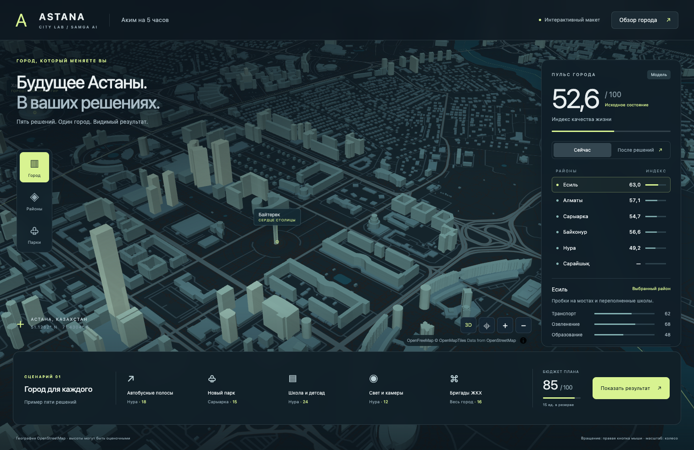

# Samga-AI — «Аким на 5 часов»

Конкурсный репозиторий команды Samga-AI для HackAlem AI, 23.09.2026.
Задача — AI-симулятор распределения городского бюджета с пятью решениями,
расчётом Astana Quality of Life Score и объяснением результата.

**Текущий этап: выбрана визуальная основа — интерактивный макет ASTANA / City Lab.**
Макет в [`demos/astana-city`](demos/astana-city/README.md) — основа дальнейшей
доработки командой. Для участников и их ИИ: **[начать с AI_START.md](AI_START.md)**.
Также сохранён аналитический сайт с четырьмя фиксированными сценариями.
Произвольный выбор пяти решений пользователем и живой AI-анализ ещё не реализованы;
этот этап не является завершённым конкурсным продуктом.

## Запуск выбранного макета

**Для команды без Git:** [скачать ZIP](https://github.com/BAITC-Hacks/hack-ad91e510-samga-ai/releases/download/astana-city-demo-v1/astana-city-demo.zip),
распаковать и открыть `START-WINDOWS.bat` или `START-MAC.command`.
Нужен Python 3. Подробно — [START-HERE.md](START-HERE.md).
Изображение ниже можно посмотреть без запуска.

При работе из клонированного репозитория можно выполнить `python3 start-demo.py`:
свободный порт выбирается автоматически, браузер открывается сам.

Из корня клонированного репозитория, с Python 3:

```sh
python3 -m http.server 4195 --bind 127.0.0.1
```

Открыть http://127.0.0.1:4195/demos/astana-city/. На Windows можно использовать
`py -m http.server 4195 --bind 127.0.0.1`. Нужны WebGL и интернет для карты;
установка пакетов и API-ключи не требуются. Остановка — `Ctrl+C`.
Сервер нужно запускать из корня: макет использует общую расчётную модель в `docs/`.



## Запуск аналитического сайта

Нужен Python 3 для просмотра сайта и Node.js 20+ для тестов. Внешние пакеты,
API-ключи, параметры окружения и личные учётные записи не требуются.

Из корня репозитория:

```sh
python3 -m http.server 4193 --bind 127.0.0.1 --directory docs/brief-analysis/dist
```

Открыть http://127.0.0.1:4193/. Остановка — `Ctrl+C`.
Открытие HTML напрямую через `file://` не поддерживается из-за ES-модулей.

## Проверка результата

```sh
node --test docs/brief-analysis/test/model.test.mjs
node --check docs/brief-analysis/dist/app.mjs
node --check docs/brief-analysis/dist/model.mjs
node --check docs/brief-analysis/dist/data.mjs
node --check demos/astana-city/app.mjs
```

На сайте открыть «Разбор сценариев» и сравнить «Пример из датасета» с «Те же меры — в Есиле»:
при одинаковой стоимости 95 итог меняется с 56.54307 до 53.8565475.
Округление применяется только для отображения. Исходная база — 52.55768.
Примеры поясняют расчёт и не являются результатами AI-вызова или доказанным оптимумом.

## Устройство и технологии

- `demos/astana-city/` — выбранный интерактивный макет: HTML/CSS, ES modules,
  локальная MapLibre GL JS 5.6.2, геометрия районов и изображения экранов.
- [AI_START.md](AI_START.md) — контекст для участников и их ИИ, карта файлов
  и готовый текст первого запроса.
- `docs/brief-analysis/dist/data.mjs` — пять условных районов, десять показателей,
  четырнадцать мер и четыре аналитических сценария.
- `docs/brief-analysis/dist/model.mjs` — чистые функции проверки ограничений,
  эффектов, лагов, синергий и итогового Score.
- `docs/brief-analysis/dist/index.html`, `app.mjs`, `style.css` — статический интерфейс
  на HTML/CSS и JavaScript ES modules, без сборщика и backend.
- `docs/brief-analysis/test/model.test.mjs` — проверки на встроенном `node:test`.
- [Исходное ТЗ](docs/brief-analysis/dist/sources/brief.pdf) и
  [датасет](docs/brief-analysis/dist/sources/dataset.docx) — оригиналы организатора.
- [Журнал этапов](PROGRESS.md) — сделанное, проверки и открытые вопросы.
- [Происхождение материалов](SOURCES.md) — входные документы, AI-инструменты и заготовки.

## Что остаётся до рабочего симулятора

1. Интерфейс самостоятельного выбора пяти решений и районов с контролем бюджета.
2. Реальный AI-анализ рассчитанного результата: сильные стороны, риски и последствия.
3. Полный пользовательский сценарий и воспроизводимый запуск конкурсной версии.

Открытое расхождение: PDF говорит о пяти направлениях, DOCX допускает до двух мер
одного направления. Текущая модель следует ограничениям DOCX; уточнение организатора
ещё не получено. Подробнее — раздел вопросов аналитического сайта.

Основную дальнейшую разработку и историю сохраняем в этом репозитории организатора.
По действующим §§5.4.8–5.4.11 требуется подтверждаемый результат каждого часа и
история работы; обязательное число коммитов каждого участника не установлено.
[Официальное положение](https://edu.astanahub.com/hackathons/df4743f5-c492-415c-b45a-1f13adb78e06?tab=regulations).

## Мини-ТЗ

Постановка из командного коммита `b5738e7` (`gtaslan2201`), объединённая
с результатами разбора датасета. Ниже описан целевой продукт; текущая реализация
и её ограничения перечислены выше.

### Цель

Показать, как распределение ограниченного городского бюджета между разными направлениями влияет на качество жизни горожан.

### Сценарий пользователя

1. Получить фиксированный виртуальный бюджет, одинаковый для всех участников.
2. Принять пять решений о распределении бюджета по направлениям:
   - транспорт;
   - озеленение;
   - социальная сфера;
   - безопасность;
   - городские сервисы.
3. Сразу увидеть последствия выбранного распределения.
4. Получить итоговый Astana Quality of Life Score и понятное объяснение того, как решения повлияли на результат.

### Требования к MVP

- Интерфейс распределения бюджета по пяти направлениям.
- Проверка, что суммарные расходы не превышают доступный бюджет.
- Расчёт Astana Quality of Life Score на основе принятых решений.
- Отображение последствий распределения бюджета.
- AI-объяснение результата: преимущества, компромиссы и последствия решений для города.

### Что уточнено по датасету

- Виртуальный бюджет — 100 условных единиц.
- Шкала показателей — 0–100; формула Score и правила влияния мер приведены в DOCX
  и воспроизведены в `docs/brief-analysis/dist/model.mjs`.
- Остаётся уточнить требование охвата всех пяти направлений: расхождение PDF/DOCX
  описано выше и не объявлено решённым.

Симулятор использует игровую модель: итоговый показатель не является официальной оценкой качества жизни в Астане.

## Проверка перед сдачей

Этот список относится к финальной конкурсной версии; готовность аналитического
этапа и выполненные проверки описаны выше и в [журнале прогресса](PROGRESS.md).

- [ ] Завершить самостоятельный выбор пяти решений и живой AI-анализ.
- [ ] Проверить полный пользовательский сценарий и обработку неверного ввода.
- [ ] Актуализировать команды установки, запуска и пример проверки финальной версии.
- [ ] Описать подключённые модели, сервисы, переменные окружения и ограничения.
- [ ] Проверить, что ключи API и другие секреты не попадают в Git.
- [ ] Зафиксировать фактический вклад участников и AI-инструментов в документации.
- [ ] Добавить deployed-ссылку, если приложение развёрнуто.
- [ ] Отправить финальный код в командный репозиторий и проверить доступность.
- [ ] Сдать решение на платформе в соответствии с инструкцией организаторов.

Перед сдачей сверить список с актуальными требованиями кейса и
[инструкцией организаторов](https://drive.google.com/file/d/105Rnhzg3Q5tKjfGZIddRqY13kmq_w4r_/view).
