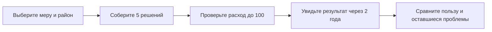

# АКИМ / SAMGA AI — «Аким на 5 часов»

**Выберите пять городских проектов, уложитесь в бюджет 100 и увидьте, кому станет лучше через два года.** Сравните свой план с альтернативами: общий балл, показатели районов и нерешённые проблемы.

Учебные данные из задания HackAlem AI. Расчёт воспроизводимый; это не официальная статистика и не прогноз реального бюджета Астаны.

## Запустить и начать

Нужны Python 3, современный браузер с WebGL и интернет для карты. Установка пакетов и аккаунт для расчёта не требуются. Из корня репозитория:

```sh
python3 -m http.server 4196 --bind 127.0.0.1
```

На Windows: `py -m http.server 4196 --bind 127.0.0.1`.

Откройте **[АКИМ](http://127.0.0.1:4196/demos/astana-story/)** → **«Открыть демонстрацию»**. Почта и пароль не нужны. Сервер останавливается клавишами `Ctrl+C`; если порт занят, задайте свободный и замените его в адресе.

`127.0.0.1` — адрес вашего компьютера. Чтобы показать продукт на другом ноутбуке, запустите там эту же версию репозитория; это не общая интернет-ссылка. Текущая локальная выгрузка на компьютере команды также открывается на **[8095](http://127.0.0.1:8095/main.html)**.

## Два понятных пути

| Хочу | Что нажать |
|---|---|
| Сначала понять идею | **«Посмотреть пример»** — готовый показ: проблема → неудачный выбор → перераспределение → сравнение |
| Принять решения самому | **«Составить свой план»** — каталог мер с ценами, районами и последствиями |
| Вспомнить порядок действий | **«Как пользоваться»** — короткая инструкция прямо в панели |



1. Нажмите **«Составить свой план»** или **«Новый план»**. Каталог откроется сразу.
2. Выберите **район мероприятия**, затем **«Добавить»** на карточке. Для городской меры район не нужен.
3. Добавьте следующие меры через **«+ Мера»**. Недоступные сочетания объясняются под названием: повтор, превышение бюджета или конфликт.
4. После **пятой допустимой меры** результат рассчитывается автоматически. До этого вместо итогового балла стоит `—`.
5. В **«Сравнение районов»** выберите нужные районы и переключите **«Сейчас / После решений»**. В **«Сравнение вариантов»** сопоставьте свой план с примерами.

Чтобы заменить меру, нажмите её название в списке решений. Выбор готового примера сохраняет ваш план **в текущей открытой странице** — вернитесь через строку **«Мой план»**. После перезагрузки начнётся новая сессия.

## Повторите проверенный пример

Одна мера из каждого из **пяти направлений**:

| Мера | Куда | Цена |
|---|---|---:|
| M1 · Выделенные полосы для автобусов | Нура | 18 |
| M4 · Парк / сквер | Сарыарка | 15 |
| M7 · Школа + детсад | Нура | 24 |
| M10 · Освещение и камеры | Нура | 12 |
| M12 · Единая цифровая платформа обращений | Весь город | 14 |

**Ожидаемый результат:** потрачено **83**, осталось **17**, индекс **52,56 → 55,61**, критических показателей **2 → 1**. Точный итог модели: `55.60722`.

В Нуре школы растут с **38 до 48**, общественный транспорт — с **40 до 46,75**. Медицина остаётся на **35**: рост общего балла не означает решения всех проблем. Парк находится в Сарыарке, потому что парк и школа несовместимы в одном районе.


**Быстрое сравнение:** выберите «Всё в Есиль», затем «Помочь слабым районам». При одинаковых расходах **95** индекс меняется **53,86 → 56,54**, критические значения **2 → 0**. Это примеры, а не доказательство глобального оптимума; второй вариант охватывает четыре направления.

## Как читать показатели

- **Бюджет** — расход и остаток из условных 100 единиц, не тенге.
- **Индекс качества жизни / Score** — общий балл модели. Он учитывает население, показатели районов, слабейший район и штраф за критические значения. Выше — лучше по правилам этого датасета.
- **Критическое значение** — показатель строго ниже **40**. Знак `!` помогает найти его.
- **Сейчас / После решений** — исходное состояние и результат на горизонте **8 кварталов**. Задержки проектов уже учтены.
- **Карта** — обзор районов; точки условные и не обозначают реальные участки строительства.

## Что реализовано по ТЗ

| Требование | Как проверить |
|---|---|
| Пять самостоятельных решений, районные и городские меры | Собрать пример выше через каталог |
| Бюджет 100, повторы и несовместимости | Каталог блокирует недопустимые варианты с причиной |
| Изменение последствий от выбора | Поменять район школы и посмотреть показатели |
| Astana Quality of Life Score | Сверить точное значение `55.60722` с примером |
| Наглядные последствия и сравнение | Таблица районов до/после и строка собственного плана |
| AI-анализ сильных сторон, рисков и последствий | В задаче ассистента подтверждены два настоящих GPT-ответа; сравнение опирается на рассчитанные числа |

**Расхождение исходников:** PDF требует пять направлений, DOCX задаёт не более двух мер из одной группы, из чего следует минимум три. Валидатор следует DOCX. Пример выше покрывает все пять; это не отменяет необходимости подтвердить трактовку задания. [PDF](docs/brief-analysis/dist/sources/brief.pdf) · [DOCX](docs/brief-analysis/dist/sources/dataset.docx).

## AI-ассистент

Расчёт чисел работает без AI. Круглая кнопка справа снизу открывает помощника по текущему плану.

Для подключения нужен Node.js и доступ к API OpenAI; для голоса — ElevenLabs. Во втором терминале, из корня:

```sh
node assistant-service/server.mjs
```

В панели ассистента откройте **«Настройки»** и введите ключи локально. Не добавляйте их в репозиторий или переписку. Подробности — в [инструкции ассистента](demos/astana-story/assistant/README.md).

**Текущий достигнутый результат:** в задаче ассистента подтверждены два настоящих GPT-ответа, включая сравнение трёх планов с правильными числами. Озвучивание ElevenLabs пока возвращает ошибку; живое распознавание речи не подтверждено. Для новой установки нужен собственный настроенный сервер: ключи хранятся в памяти локального процесса и в репозиторий не входят. Доступ эксперта без личных аккаунтов участников нужно проверить отдельно.

## Мобильное приложение: две роли

| Роль | Понятный маршрут |
|---|---|
| **Аким** | Открыть демоверсию → События → Взять на контроль → Помощник → Проект поручения → Сохранить черновик |
| **Житель** | Фото / Голос / Текст → проверить место → Отправить в демо → Открыть обращение → посмотреть статус |

Это **отдельные локальные iPhone-демо**, дополняющие веб-сценарий. Связь между приложениями, вебом и реальными службами пока не подключена. [Подробный мобильный сценарий и границы проверки](docs/user-guide/MOBILE.md). Мобильные исходники находятся в отдельных локальных проектах команды и не входят в эту ветку.

## Что ещё не объединено

Интеграционная версия с сервером, поиском планов и скачиванием HTML/JSON находится отдельно. В новой панели эти функции пока не объединены в один путь. До сдачи нужно зафиксировать **одну общую сборку**, проверить её по инструкции на другом ноутбуке, подтвердить доступ эксперта к AI, затем публикацию и отправку на платформе. Локальная готовность не означает принятую сдачу.

## Для команды и проверки

[Начать разработку](AI_START.md) · [Происхождение материалов](SOURCES.md) · [Происхождение текущей панели](demos/astana-story/ORIGIN.md) · [История этапов](PROGRESS.md).

Минимальные проверки расчётного пути, Node.js 20+:

```sh
node --test docs/brief-analysis/test/model.test.mjs demos/astana-story/comparison.test.mjs demos/astana-story/planner.test.mjs
node --check demos/astana-story/onboarding.mjs
```

В этом проходе **25/25 проверок** прошли, пример из пяти направлений собран вручную в браузере. Текстовый AI подтверждён в задаче ассистента. Голос, другой ноутбук, доступ эксперта и финальная сдача остаются отдельными незавершёнными шагами.

<details>
<summary>Исходное командное мини-ТЗ и вклад</summary>

## Мини-ТЗ

Постановка из командного коммита `b5738e7` (`gtaslan2201`), объединённая
с результатами разбора датасета. Ниже описан целевой продукт; текущая реализация
и её ограничения перечислены выше.

### Цель

Показать, как распределение ограниченного городского бюджета между разными направлениями влияет на качество жизни горожан.

### Сценарий пользователя

1. Получить фиксированный виртуальный бюджет, одинаковый для всех участников.
2. Принять пять решений о распределении бюджета по направлениям:
   - транспорт;
   - озеленение;
   - социальная сфера;
   - безопасность;
   - городские сервисы.
3. Сразу увидеть последствия выбранного распределения.
4. Получить итоговый Astana Quality of Life Score и понятное объяснение того, как решения повлияли на результат.

### Требования к MVP

- Интерфейс распределения бюджета по пяти направлениям.
- Проверка, что суммарные расходы не превышают доступный бюджет.
- Расчёт Astana Quality of Life Score на основе принятых решений.
- Отображение последствий распределения бюджета.
- AI-объяснение результата: преимущества, компромиссы и последствия решений для города.

### Что уточнено по датасету

- Виртуальный бюджет — 100 условных единиц.
- Шкала показателей — 0–100; формула Score и правила влияния мер приведены в DOCX
  и воспроизведены в `docs/brief-analysis/dist/model.mjs`.
- Остаётся уточнить требование охвата всех пяти направлений: расхождение PDF/DOCX
  описано выше и не объявлено решённым.

Симулятор использует игровую модель: итоговый показатель не является официальной оценкой качества жизни в Астане.


</details>
